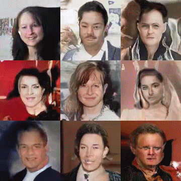
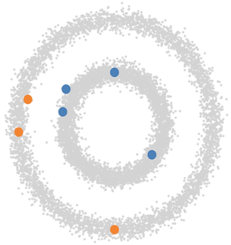
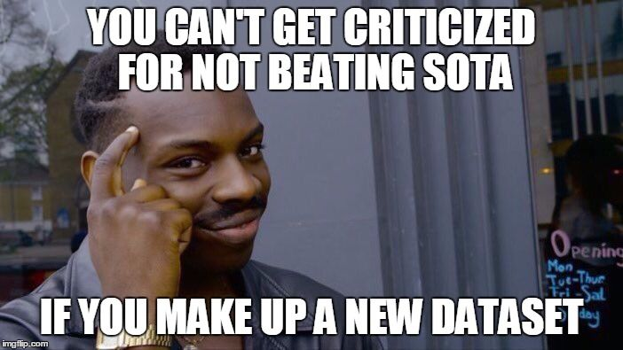
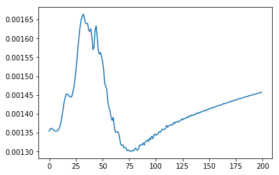
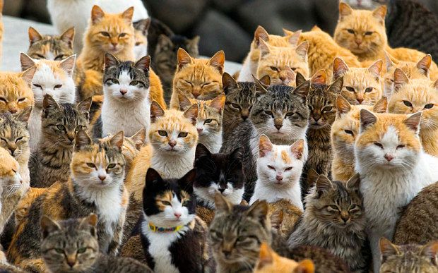
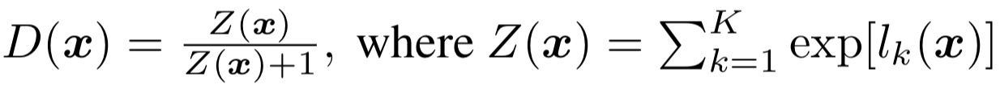
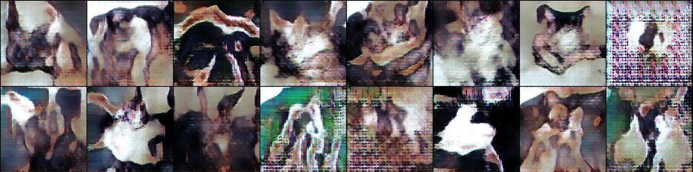

A semi-supervised GAN for image classification implemented in Pytorch

* 13.02.2020: I am currently researching a new approach to semi-supervised learning with GANs, so this page will get updated periodically. In the meantime, please feel free to read on for a (hopefully, painless) introduction into the topic, check out [the slides I used for a meetup talk](220120_meetup_slides.pdf) on this subject, or [watch the video of the said meetup](https://lnkd.in/gWV3x8u) (semi-supervised GANs start at 17:30).

______________________

# Semi-Supervised Learning with GANs: a Tale of Cats and Dogs 

*In this article we present an easy-to-grasp way of looking at semi-supervised machine learning - a solution to the common problem of not having enough labeled data. We then go through the steps of using a Generative Adversarial Network architecture for the task of image classification. Read on to find out how to get a 20% increase in accuracy\*  when distinguishing cats and dogs with only 100 labeled images!*

*\*Compared to the fully supervised classifier trained on labeled images only*

## Semi-Supervised Learning: the Why and the What
If you are at all interested in artificial intelligence, it is likely that reading about a new breakthrough achieved by an AI model has become part of your routine. One day [AI attains better accuracy on screening mammograms for breast cancer than trained experts](https://blog.google/technology/health/improving-breast-cancer-screening) (human or [avian](https://www.bbc.com/news/science-environment-34878151)), and next it [beats top human players at StarCraft II](https://www.nature.com/articles/d41586-019-03298-6). What is behind many of these success stories is deep learning: a branch of machine learning that deals with a particular class of models, deep artificial neural networks. Proposed as early as in [1960s](https://books.google.fr/books?id=rGFgAAAAMAAJ), this field has undergone a vigorous revival in the last decade, revolutionizing the domains of computer vision and natural language processing (NLP) along the way.

Advancing the current state-of-the-art in deep learning is often realised at the cost of introducing larger models than ever before. This comes with its own set of challenges. Naturally, models with a lot of trainable parameters (tens and even hundreds of millions is not uncommon at this point!) require large training sets. Supervised machine learning remains the go-to approach for many practical applications - meaning that these training sets often have to be manually labeled. There are different strategies aimed at getting away with a smaller amount of training data, such as transfer learning (pre-training the model on an existing, large dataset). Alternatively, you can come up with a self-supervised task, where the data will be "labeled" automatically, and fine-tune the model later on. The self-supervised learning approach has proven especially useful in NLP, where [word embeddings](https://towardsdatascience.com/what-the-heck-is-word-embedding-b30f67f01c81) can be pre-trained via masked language modeling (predicting words that are omitted from a sentence at random) and then used on downstream supervised tasks, such as question answering, machine translation etc.

Not every task is susceptible to this kind of treatment, however. Take image classification as an example. It is difficult to come up with an automatic labelling scheme for a pre-trained self-supervised model that would be useful for the classification task at hand. Transfer learning, on the other hand, has come to be the starting point of choice for many computer vision applications. However, let us consider a scenario when, while a subset of our training data is labelled, the rest is not. Transfer learning alone has no use for the unlabelled part of the training set, but is there any way we can still benefit from those unlabelled training samples? Indeed, that is what the so-called semi-supervised learning is all about.

For many domains of interest, gathering data is relatively easy, whereas labelling it by human experts is expensive and time consuming. Semi-supervised learning provides a solution by learning the patterns present in unlabelled data, and combining that knowledge with the (generally, fewer) labeled training samples in order to accomplish a supervised learning task - e.g. image classification.

In this post we are going to consider a semi-supervised learning approach that involves [Generative Adversarial Networks (GANs)](https://arxiv.org/abs/1406.2661), an artificial neural network architecture that was originally developed in the context of unsupervised learning. The latter means that the training data is unlabeled, and the sole goal of the GAN is to generate new synthetic data coming from the same distribution as those in the training set. That is to say that a GAN trained on the (unlabelled) [MNIST](https://en.wikipedia.org/wiki/MNIST_database) set of handwritten digits would produce images that look like, well - handwritten digits!

The idea behind using GANs for semi-supervised learning can be roughly understood in the following way: say your training set is MNIST, but only a few examples of each digit from 0 to 9 are actually labeled. A good GAN that has been trained on unlabelled MNIST would learn to generate various versions of all the digits - suggesting that it knows a thing or ~~ten~~ two about the underlying data distribution. We can then think of a part of what the GAN is doing as almost a form of *clustering:* assigning data points to groups based on their features. Since a few points out of each cluster are labeled, we can proceed to label the rest of the points accordingly, arriving at what we were after all along: a handwritten digit classifier.

Before we dive into the intricacies of a semi-supervised GAN, let us review the original unsupervised GAN architecture.

## Generative Adversarial Networks: this GAN does not exist

Generative Adversarial Networks, or, as Yann LeCun, VP and Chief AI Scientist at Facebook, once put it, "the most interesting idea in the last ten years in Machine Learning", were invented [back in 2014 by Ian Goodfellow and company](https://arxiv.org/abs/1406.2661). GANs are the artificial brains behind the impressive [ThisPersonDoesNotExist.com](https://thispersondoesnotexist.com), the cute [ThisCatDoesNotExist.com](https://thiscatdoesnotexist.com), but, however, not the at-times-surprising [ThisSnackDoesNotExist.com](https://thissnackdoesnotexist.com).



In a standard GAN setup, there are two networks: a *Generator*, producing images out of input noise vectors, and a *Discriminator*. The objective of the Discriminator is to detect which images are coming from the training set (i.e. "are real") and which ones have been produced by the Generator (i.e. "are fake"). It follows that as far as  the Discriminator is concerned, the problem is simply that of binary classification. The way, that the Generator is trained, is a little less straightforward: its task is to fool the Discriminator. While this may sound cryptic, the implementation is simple enough. First, the Generator takes in a vector of random noise as input and produces an image. Naturally, the output image depends on the Generator's parameters. Then this synthetic image gets passed on as input to the Discriminator, which will return, say, the probability of the image being real (i.e. coming from the training set). At this point we are going to keep the Discriminator unchanged, and instead update the Generator in such a way that its next output would be more likely to be accepted by the Discriminator as real. The Discriminator and the Generator proceed to be updated in an alternating manner, once each for every mini batch of the training data. To see a Pytorch implementation of a GAN with (de)convolutional layers, called [DCGAN](https://arxiv.org/abs/1511.06434), you can checkout [this tutorial](https://pytorch.org/tutorials/beginner/dcgan_faces_tutorial.html).

## GANs in Semi-Supervised Learning
In an unsupervised GAN, what you are after is the Generator. The Discriminator is just a means to an end: it is used to train the Generator, only to be discarded at the end. In this section, we are going to switch gears and look at what the Discriminator has to offer in the semi-supervised setting.

### Semi-Supervised GAN: the 200 Words Summary
Let's go back to that "clustering" idea that we handwaved around back in the introduction. Imagine your classification task is concerned with datapoints that only have two features (which makes them easy to plot by taking one feature as *x* and the other as *y* coordinates on a plane). Moreover, here is what your data looks like when plotted:


There are two circles (rings with certain radii, to be precise), each corresponding to its own class: *oranges* and *blues*. Frankly, you don't need deep learning to tackle this problem: a simple [classical machine learning approach would do the trick](https://scikit-learn.org/stable/auto_examples/classification/plot_classifier_comparison.html). But bear with me! Let's say you only have a few of the points actually labeled, perhaps something along the lines of:



If you were to only use the few labeled points that you have to train your classification model, you obviously would not get very far. A GAN, however, will easily figure out that it is to generate points within the two rings, when you provide it with the whole dataset (including the unlabelled greyed out points). The labeled points can then be used to classify the two rings as belonging to two separate classes and voilà, you are done!

### Discriminator to Classifier
It is time to see how all this can be carried out in practice  \[[1](https://arxiv.org/abs/1606.03498), [2](https://arxiv.org/abs/1511.06390)\]. Consider an image classification problem that has *K* classes (e.g. *K = 10* for handwritten digit recognition, or *K = 2* for the toy dataset with two circles above). Let us add an additional class that will designate "fake" images - meaning, the ones that do not come from the training set. Sounds familiar? Indeed, we can use the resulting Classifier with *K+1* classes in place of the Discriminator that we had in the unsupervised GAN. If the image gets assigned to one of the first *K* classes, we are going to deem it "real", whereas class *K+1* is reserved for images that the Classifier believes to have been generated by the Generator.

The training scheme for the Generator remains largely unchanged: its objective is to produce images that the Classifier will assign to one of the original *K* classes. In the simplest case that we are considering, the Generator does not care which ones, as long as they are "real".

The Discr... I mean, Classifier will have more on its plate this time. There are three types of data that it will have access to:

* labeled training data (that we want the Classifier to assign to correct classes)

* unlabeled training data (that we just want assigned to *one of K* classes)

* synthetic/generated/fake data - i.e. the images that have been generated by the Generator. These should get assigned to the additional class, *K+1*.

Aside from having two kinds of real data to deal with (and, as a result, two contributions to the loss function for the real images), the training of the semi-supervised Classifier is carried out in much the same way as that of the unsupervised Discriminator above.

Before we get coding, however, let us think about the Generator for a second. Having seen the very impressive results that have been obtained for the unsupervised GANs, one might wonder how good are the Generators trained in the semi-supervised regime (even if we do care mainly about the Classifier in this case).

### Good GAN, Bad GAN
As it turns out, [it takes a fairly "bad" Generator to get good performance out of the Classifier](https://arxiv.org/abs/1705.09783). To understand why this is the case, we are going to turn back to our trusted two circle example:


What kind of data would an ideal unsupervised Generator generate? It would, of course, produce more points that make up the two disks. However, if you look at the  image above, it should not be hard to convince yourself that not having enough unlabelled points filling in the disks, is the least of our problems. If a good Generator does not help in the classification task, what does? A bad Generator.

What is a bad Generator? A Generator that spits out random noise is certainly a bad one, but that won't help us as far as classifying anything goes. Consider instead a *complement* Generator: a Generator that produces datapoints that are *complimentary* to the real ones in feature space. For instance, points that are located in between the two disks:


Producing "fake" points in between the two circles will help the Classifier assign the real points to correct class: whatever is real and has a smaller distance to the center than the fake belt, is blue, amd whatever is real and has a larger radius is orange. In other words, a complement Generator helps refine the *decision boundary* between classes. 

We shall see some more real-world examples of images generated in complimentary feature space when we look at the semi-supervised GAN that I wrote and trained for the cat vs. dog binary classification. Speaking of which, it is time to find out...

## ...What Happens When Cats and Dogs are Left Unsupervised
For your convenience, [this repository includes a Jupyter notebook containing all the code in one place](https://github.com/opetrova/SemiSupervisedPytorchGAN/blob/master/SemiSupervisedGAN.ipynb). Below we are going to go through each part in detail, but before we do that, let us get the imports and a few other setup-type things out of the way:

```
from __future__ import print_function, division

import random
from random import shuffle

import numpy as np
import matplotlib.pyplot as plt
import copy

import os
from os import listdir
from os.path import join

import torch
import torch.nn as nn
import torch.optim as optim
from torch.optim import lr_scheduler
from torch.autograd import Variable
import torch.nn.functional as F

import torchvision
import torchvision.utils as vutils
from torchvision import utils, models

from nvidia.dali.pipeline import Pipeline
import nvidia.dali.ops as ops
import nvidia.dali.types as types
from nvidia.dali.plugin.pytorch import DALIGenericIterator, DALIClassificationIterator

import warnings
warnings.filterwarnings("ignore")

np.random.seed(42)
random.seed(10)
torch.backends.cudnn.deterministic = True
torch.backends.cudnn.benchmark = False
torch.manual_seed(999)

device = torch.device("cuda")
```

### The Data



Most of the published work on semi-supervised GANs \[[3](https://arxiv.org/abs/1703.02291), [4](https://arxiv.org/abs/1910.08540), in addition to the articles that I have already cited above\] has been benchmarked on a few standard computer vision datasets: [MNIST](https://en.wikipedia.org/wiki/MNIST_database) (black and white 28x28 pixel images of handwritten digits), [SVHN](http://ufldl.stanford.edu/housenumbers/) (the street view house numbers,  32x32 pixels) and [CIFAR10](https://www.cs.toronto.edu/~kriz/cifar.html) (32x32 color images each belonging to one of 10 classes). For this tutorial I chose to use the [Dogs vs. Cats dataset available on Kaggle](https://www.kaggle.com/c/dogs-vs-cats/data), which provides the added benefit of being able to look at pictures of cats and dogs at work for perfectly legitimate reasons. Out of the 37.5K images, I set aside 1000 for validation and test sets each, kept 100 (50 cats and 50 dogs) as labeled images and used the rest as unlabelled training data. The Kaggle dataset offers a nice variety of photos: there are different breeds of dogs and cats, some images contain multiple animals (of the same class), some also include humans and various obstructions, some are taken outdoors, some indoors, etc. One of the pre-processing steps was resizing each image to 224x224 pixels, occasionally resulting in some rather plumpy pets:


Unlike its cropping cousin, resizing images is a step that takes the CPU a potentially annoying amount of time. Fortunately, [NVIDIA provides a nice library called DALI](https://github.com/NVIDIA/DALI) dedicated to building image pipelines of arbitrary complexity that can do all sorts of pre-processing operations straight on the GPU. DALI is compatible with Pytorch and TensorFlow deep learning frameworks, among others, and I highly recommend it to anyone working in the computer vision field. Speaking of Pytorch, below is the code for the DALI-powered Pytorch dataloaders, both labeled and unlabelled, for the semi-supervised GAN:

```
def is_jpeg(filename):
    return any(filename.endswith(extension) for extension in [".jpg", ".jpeg"])

class ExternalInputIterator(object):

    def __init__(self, imageset_dir, labeled, batch_size, random_shuffle=False):
        self.images_dir = imageset_dir
        self.batch_size = batch_size
        self.labeled = labeled # True is images are labeled, False otherwise

        self.image_files = np.array([join(imageset_dir, file_name) for file_name in sorted(listdir(imageset_dir)) if is_jpeg(file_name)])
        
        # In my dataset, filenames are of the form "cat_***.jpg" or "*cat_***.jpg" (same for dogs)
        # The map below infers the image's label from its the second character of its filename
        self.class_map = {'a': 0, 'o': 1, 'c': 0, 'd': 1}
        self.offset = len(self.images_dir) + 2
        
        if random_shuffle:
            ind = np.array(range(len(self.image_files)))
            shuffle(self.image_files)

    def __iter__(self):
        self.i = 0
        self.n = len(self.image_files)
        return self


    # Return a batch of (input, target) pairs
    def __next__(self):
        
        images = []
        labels = []

        for _ in range(self.batch_size):
            image_file = self.image_files[self.i]
            if self.labeled:
                label = self.class_map[self.image_files[self.i][self.offset]]
                labels.append(np.array([label], dtype = np.uint8))
            image = open(image_file, 'rb')
            images.append(np.frombuffer(image.read(), dtype = np.uint8))
            image.close()

            self.i = (self.i + 1) % self.n
        if self.labeled:
            return (images, labels)
        return images

    next = __next__

class PetPipeline(Pipeline):
    '''
    Constructor arguments:  
    - imageset_dir: directory containing the dataset
    - labeled = True
    - image_size = 128: length of the square that the images will be resized to
    - random_shuffle = False
    - batch_size = 64
    - num_threads = 1
    - device_id = 0
    '''

    def __init__(self, imageset_dir, labeled=True, image_size=128, random_shuffle=False, batch_size=64, num_threads=1, device_id=0):
        super(PetPipeline, self).__init__(batch_size, num_threads, device_id, seed=12)  
        eii = ExternalInputIterator(imageset_dir, labeled, batch_size, random_shuffle)
        self.iterator = iter(eii)
        self.num_inputs = len(eii.image_files)
        self.labeled = labeled

        # The source for the inputs
        self.input = ops.ExternalSource()
        self.input_label = ops.ExternalSource()

        self.decode = ops.ImageDecoder(device = 'mixed', output_type = types.RGB)

        # The rest of pre-processing is done on the GPU
        self.res = ops.Resize(device="gpu", resize_x=image_size, resize_y=image_size)
        self.norm = ops.CropMirrorNormalize(device='gpu', mean=0, std=255.0)


    # epoch_size = number of (profile, frontal) image pairs in the dataset
    def epoch_size(self, name = None):
        return self.num_inputs


    # Define the flow of the data loading and pre-processing
    def define_graph(self):   
        
        if self.labeled:
            self.labels = self.input_label()
        self.jpegs = self.input()
        images = self.decode(self.jpegs)
        images = self.res(images)
        output = self.norm(images)
        if self.labeled:
            self.labels = self.input_label()
            return (output, self.labels)
        else:
            return output
    
    def iter_setup(self):
        if self.labeled:
            (images, labels) = self.iterator.next()
            self.feed_input(self.jpegs, images)
            self.feed_input(self.labels, labels)
        else:
            images = self.iterator.next()
            self.feed_input(self.jpegs, images)
            
labeled_train_dir = 'data/labeled'
labeled_batch = 100 
# labeled_batch = total number of labeled training samples since it is small enough

unlabeled_train_dir = 'data/train'

val_dir = 'data/val'
test_dir = 'data/test'            
            
# Validation and test LABELED dataloaders:          
            
val_pipe = PetPipeline(val_dir, True, image_size=224, random_shuffle=True, batch_size=512)
val_pipe.build()
val_loader = DALIClassificationIterator(val_pipe, val_pipe.epoch_size())

test_pipe = PetPipeline(test_dir, True, image_size=224, random_shuffle=True, batch_size=100)
test_pipe.build()
test_loader = DALIClassificationIterator(test_pipe, test_pipe.epoch_size())

# The LABELED training dataloader:

labeled_pipe = PetPipeline(labeled_train_dir, True, image_size=224, random_shuffle=False, batch_size=labeled_batch)
labeled_pipe.build()
m_l = labeled_pipe.epoch_size()
labeled_loader = DALIClassificationIterator(labeled_pipe, m_l)

# Since we only have one batch in the Labeled dataloader, 
# we might as well get that batch now and not bother with the dataloader:

labeled_batch = next(iter(labeled_loader))
labeled_data = labeled_batch[0]['data'].type('torch.FloatTensor').to(device)
labels = labeled_batch[0]['label'].type(dtype=torch.long).squeeze().to(device)
 
# The UNLABELLED training dataloader: 
 
train_pipe = PetPipeline(unlabeled_train_dir, False, image_size=224, random_shuffle=True, batch_size=64)
train_pipe.build()
m_train = train_pipe.epoch_size()
train_loader = DALIGenericIterator(train_pipe, ['data'], m_train)  
```

### The Supervised Classifier
The baseline for our classification performance will be a classifier that is only trained on the 100 labeled training samples that we use for the semi-supervised model. For the Classifier, I chose the standard [ResNet18 architecture](https://arxiv.org/abs/1512.03385) with *K=2* output neurons:

```
# Use a (not pre-trained) ResNet18 with d_out = 2 as the Classifier
classifier = models.resnet18()
num_ftrs = classifier.fc.in_features
classifier.fc = nn.Linear(num_ftrs, 2)
classifier = classifier.to(device)

optimizerC = optim.SGD(classifier.parameters(), lr=0.001, momentum=0.9, dampening=0, weight_decay=0.0001)
```

Now let's train this model to see how far we can get on supervised machine learning alone:

```
def test(model, device, test_loader, m_test, display = False):
    model.eval()
    test_loss = 0
    correct = 0
    with torch.no_grad():
        for batch in test_loader:
            data = batch[0]['data'].type('torch.FloatTensor').to(device)
            target = batch[0]['label'].type(dtype=torch.long).squeeze().to(device)
            output = model(data)
            test_loss += criterion(output, target).item() 
            pred = output.argmax(dim=1, keepdim=True)
            correct += pred.eq(target.view_as(pred)).sum().item()

    test_loss /= m_test

    if display == True:
        print('\nTest set: Average loss: {:.4f}, Accuracy: {}/{} ({:.0f}%)\n'.format(
        test_loss, correct, m_test,
        100. * correct / m_test))
        
    test_loader.reset()    
    return test_loss, 100. * correct / m_test


criterion = nn.CrossEntropyLoss()

epochs = 200

val_losses = []
val_accuracies = []

best_model_wts = copy.deepcopy(classifier.state_dict())
best_acc = 0.0

for epoch in range(1, epochs + 1):
    
    classifier.train()
    
    optimizerC.zero_grad()
    output = classifier(labeled_data)
    loss = criterion(output, labels)
    loss.backward()
    
    if epoch % 50 == 0:
        print('Train Epoch: {} \tLoss: {:.6f}'.format(epoch, loss.item()))
    
        val_loss, val_accuracy = test(classifier, device, val_loader, val_pipe.epoch_size(), True)
        val_losses.append(val_loss)
        val_accuracies.append(val_accuracy)
    else:
        val_loss, val_accuracy = test(classifier, device, val_loader, val_pipe.epoch_size(), False)
        val_losses.append(val_loss)
        val_accuracies.append(val_accuracy)
        
    if val_accuracy > best_acc:
        best_acc = val_accuracy
        best_classifier_wts = copy.deepcopy(classifier.state_dict())
        
    optimizerC.step()
        
plt.plot(range(len(val_losses)), np.array(val_losses))
plt.show()

print('Best VAL test accuracy: ', np.max(np.array(val_accuracies)),
      '% after ', np.argmax(np.array(val_accuracies)), ' training epochs')

# load best model weights
classifier.load_state_dict(best_classifier_wts)

print("\n Best model on the test set: ")
test(classifier, device, test_loader, test_pipe.epoch_size(), True)
```

A plot of the validation loss that we kept track of while training the model reveals a familiar picture: there is a regime where the model learns features that are useful for classification (~ the first 77 training epochs), followed by the stage where the model is overfitting to the train set (hence the increase in the validation loss).



*Loss on the validation set for the supervised ResNet18 classifier vs. number of training epochs*

The top accuracy on the balanced validation set is 61.4%, achieved after 77 epochs. The test set accuracy for this model is close: 60.2%. Let's see if we can do better with the help of the roughly 35K unlabelled cats and dogs that we have lying around!



*Despite of what this image suggests, our train set is split evenly between cats and dogs*

### Attention: Loss Function for the Semi-Supervised Classifier
Before we finish off with the code for the semi-supervised GAN, I would like to discuss the choice of the loss function that is used for the Classifier/Discriminator. The most straightforward way to implement the ideas discussed in this blogpost would be to explicitely add a third class to designate the "fakes", and, e.g. via a final `softmax` layer, to: 1) minimize the probability that unlabeled images from the training set get assigned to the Fake class and 2) minimize the probability that the images produced by the Generator get classified as Cats and Dogs. However, having tried this, I must say that I was not able to get the resulting model to beat the supervised baseline. Instead, I found it best to adopt the approach taken by \[[1](https://arxiv.org/abs/1606.03498), [2](https://arxiv.org/abs/1511.06390)\] and used the following expression as part of the semi-supervised Classifier loss:



where ***x*** is an input image, and *l* are the logits from the final layer of the classifier. Notice that the sum over logits goes from 1 to *K* instead of from 1 to *K+1*: in fact, the additional *K+1* class has not been explicitly added, and the architecture of the semi-supervised Classifier is identical to that of the supervised version! However, the presence of the Fake class is *implied* in the loss function: the value of *D(**x**)* is close to 1 when a strong prediction has been made for one of the *K* (real) classes, and close to zero when all *K* logits' values are small. In fact, you can think of this as the probability of ***x*** being real, with the alternative being the *K+1* fake class.

### The Semi-Supervised \[DCRes\]GAN

The Generator that I used for my semi-supervised GAN was heavily inspired by the [DCGAN](https://pytorch.org/tutorials/beginner/dcgan_faces_tutorial.html) (the [Deep Convolutional GAN](https://arxiv.org/abs/1511.06434)), adjusted to produce images that are 224x224 pixels in size:

```
# custom weights initialization called on the Generator
def weights_init(m):
    classname = m.__class__.__name__
    if classname.find('Conv') != -1:
        nn.init.normal_(m.weight.data, 0.0, 0.02)
    elif classname.find('BatchNorm') != -1:
        nn.init.normal_(m.weight.data, 1.0, 0.02)
        nn.init.constant_(m.bias.data, 0)
        

# Number of channels in the training images. For color images this is 3
nc = 3
# Size of z latent vector 
nz = 100
# Size of feature maps in generator
ngf = 64

class Generator(nn.Module):
    def __init__(self):
        super(Generator, self).__init__()
        self.main = nn.Sequential(
            # input is Z, going into a convolution
            nn.ConvTranspose2d( nz, ngf * 8, 7, 1, 0, bias=False),
            nn.BatchNorm2d(ngf * 8),
            nn.ReLU(True),
            # state size. (ngf*8) x 7 x 7
            nn.ConvTranspose2d(ngf * 8, ngf * 4, 4, 2, 1, bias=False),
            nn.BatchNorm2d(ngf * 4),
            nn.ReLU(True),
            # state size. (ngf*4) x 14 x 14
            nn.ConvTranspose2d( ngf * 4, ngf * 2, 4, 2, 1, bias=False),
            nn.BatchNorm2d(ngf * 2),
            nn.ReLU(True),
            # state size. (ngf*2) x 28 x 28
            nn.ConvTranspose2d( ngf * 2, ngf, 4, 4, 0, bias=False),
            nn.BatchNorm2d(ngf),
            nn.ReLU(True),
            # state size. (ngf) x 112 x 112
            nn.ConvTranspose2d( ngf, nc, 4, 2, 1, bias=False),
            nn.Tanh()
            # state size. (nc) x 224 x 224
        )

    def forward(self, input):
        return self.main(input)
    
# A noise vector to be used for generating images at the end of each training epoch
fixed_noise = torch.randn(64, nz, 1, 1, device=device)

netG = Generator().to(device)
netG.apply(weights_init)

optimizerG = optim.Adam(netG.parameters(), lr=0.002, betas= (0.5, 0.999))
```

For the sake of comparison, I used the same exact ResNet18 network for the Discriminator/Classifier as for the supervised baseline:

```
classifier = models.resnet18()
num_ftrs = classifier.fc.in_features
classifier.fc = nn.Linear(num_ftrs, 2)
classifier = classifier.to(device)

optimizerC = optim.Adam(classifier.parameters(), lr=0.002, betas= (0.5, 0.999))
```

Finally, here comes the training of the GAN:

```
def log_sum_exp(x, axis = 1):
    m = torch.max(x, dim = 1)[0]
    return m + torch.log(torch.sum(torch.exp(x - m.unsqueeze(1)), dim = axis))
    
val_losses = []
val_accuracies = []

best_model_wts = copy.deepcopy(classifier.state_dict())
best_acc = 0.0

epochs = 100

for epoch in range(1, epochs + 1):

    for batch_idx, batch in enumerate(train_loader):
        
        # TRAIN THE DISCRIMINATOR (THE CLASSIFIER)
        classifier.train()
        optimizerC.zero_grad()
        
        # 1. on Unlabelled data
        data = batch[0]['data'].type('torch.FloatTensor').to(device)        
        outputs = classifier(data)    
        logz_unlabel = log_sum_exp(outputs)
        lossUL = 0.5 * (-torch.mean(logz_unlabel) + torch.mean(F.softplus(logz_unlabel)))
        lossUL.backward()  
        
        # 2. on the generated data

        noise = torch.randn(batch_size, 100, 1, 1, device=device)
        generated = (netG(noise)+1.0)/2.0
        outputs = classifier(generated.detach()) # detach() because we are not training G here
        logz_fake = log_sum_exp(outputs)
        lossD = 0.5*torch.mean(F.softplus(logz_fake))
        lossD.backward()
        
        # 3. on labeled data
        output = classifier(labeled_data)
        logz_label = log_sum_exp(output)
        prob_label = torch.gather(output, 1, labels.unsqueeze(1))
        labeled_loss = -torch.mean(prob_label) + torch.mean(logz_label)
        labeled_loss.backward()    

        optimizerC.step()
        
        # TRAIN THE DISCRIMINATOR (THE CLASSIFIER)
        netG.train()
        optimizerG.zero_grad()
        
        outputs = classifier(generated)
        logz_unlabel = log_sum_exp(outputs)
        lossG = 0.5 * (-torch.mean(logz_unlabel) + torch.mean(F.softplus(logz_unlabel)))
        lossG.backward()
        optimizerG.step()
            
    train_loader.reset()
    
    generated = (netG(fixed_noise)+1.0)/2.0
    vutils.save_image(generated.cpu().detach(), ('generated_%d.jpg' % epoch), normalize=True)
    
    val_loss, val_accuracy = test(classifier, device, val_loader, val_pipe.epoch_size(), True)
    val_losses.append(val_loss)
    val_accuracies.append(val_accuracy)
        
    if val_accuracy > best_acc:
        best_acc = val_accuracy
        best_classifier_wts = copy.deepcopy(classifier.state_dict())

plt.plot(range(len(val_losses)), np.array(val_losses))
plt.show()

print('Best VAL test accuracy: ', np.max(np.array(val_accuracies)),
      '% after ', np.argmax(np.array(val_accuracies)), ' training epochs')

# load best model weights
classifier.load_state_dict(best_classifier_wts)

print("\nBest model on the test set: ")
test(classifier, device, test_loader, test_pipe.epoch_size(), True)    
```

### Results and Discuission
Since we are using so few labeled samples to train our semi-supervised model, its final performance will inevitably depend on the choice of the images which are labeled. I found it best to label the most *representative* images: in practice I randomly chose 50 dogs and 50 cats from the train set, and then replaced the images that contained multiple animals, humans, or too many obstructions. I also made sure that there was an equal number of indoor vs. outdoor images for the two classes. This curated set showed the biggest improvement when used with the semi-supervised GAN. Below is the table comparing the test set accuracies of the two approaches (supervised model trained for 77 epochs vs. GAN trained for 40 epochs with batch_size=64 for the unlabelled images):

| Supervised ResNet18 | Semi-supervised GAN  |  
|---|---|
| 60.2%  | 83.2%  |

A 23% improvement when putting the unlabelled data to use! However, when tested on the labeled sets of the same size that were chosen completely at random, the average increase in test set accuracy amounted to only 10%. It follows that care should be taken when choosing which training samples to label (in the event that the choice is available, of course).
Coming back to the point that was made about "bad" Generators earlier, here are the kinds of images we end up generating during training:



*Some of the "complement" dog-cats that were generated after 13 training epochs, when the Classifier already beat the supervised baseline by ~10% in accuracy*

### Conclusion
Data, its quantity and quality, is one of the major factors contributing to the success or failure of a machine learning project. Labelling the said data is a bottleneck that is hard to optimize since it generally requires human expertise. Semi-supervised learning provides another route to getting the job done: instead of labelling additional training data, the model's performance can be enhanced through the use of unlabelled training samples. A semi-supervised GAN is one of the possible approaches to take you futher in this direction!

(Originally published [here](https://blog.scaleway.com/2020/semi-supervised/))
